# 입찰왕(Bid King)

실시간 경매 라이브 플랫폼
---

## 팀 멤버

<table>
  <tr>
    <td align="center">
      <a href="https://github.com/brewcoldblue">
         
        <b>유승윤</b> 
        Frontend
      </a>
    </td>
    <td align="center">
      <a href="https://github.com/yongseong2">
         
        <b>김성용</b> 
        Frontend
      </a>
    </td><td align="center">
      <a href="https://github.com/DJ-archive">
         
        <b>윤다정</b> 
        Backend
      </a>
    </td><td align="center">
      <a href="https://github.com/jeong-yeji">
         
        <b>정예지</b> 
        Backend
    	</a>
    </td><td align="center">
      <a href="https://github.com/DHKIM-0511">
         
        <b>김동현</b> 
        Backend
    	</a>
    </td><td align="center">
      <a href="https://github.com/yyanoos">
         
        <b>이연우</b> 
        Backend
 	   </a>
    </td>
  </tr>
</table>

## 서비스 화면
[경매 진행 파트 유튜브 영상](https://www.youtube.com/watch?v=iyUf4gSRbaA)

- 회원 기능

  - 회원가입

    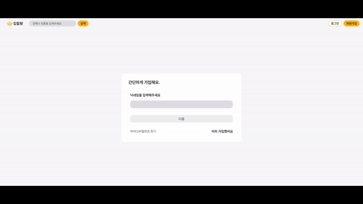

  - 로그인

    

- 경매 CRUD

  - 경매 생성

  - 경매 수정

  - 경매 삭제

    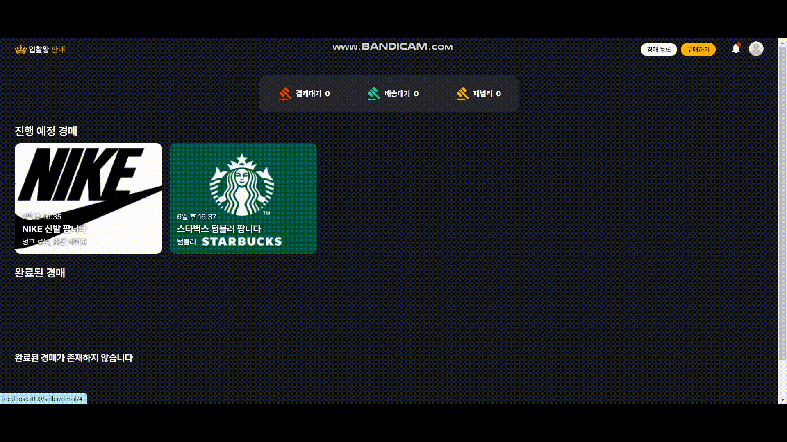

  - 경매 목록 확인

  - 관심 경매 등록 및 삭제

    

  - 경매 상세 확인

    - 판매자

      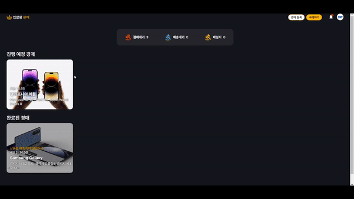

    - 구매자

      

  - 판매 내역 확인 (판매자)

    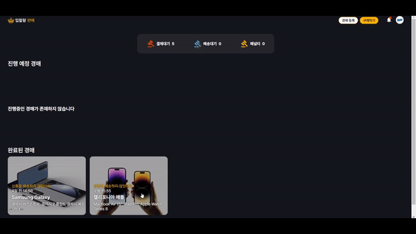

  - 낙찰 내역 확인 (구매자)

    

- 경매 라이브

  - 라이브 화면

    - 판매자

    - - live-seller-enter.gif
      - live-seller-onoff.gif
      - live-seller-notice.gif
      - live-seller-item-fail.gif
      - live-seller-leave.gif

    - 구매자
      - live-enter.gif
      - live-item-fail.gif
      - live-leave.gif

  - 입찰 컴포넌트

    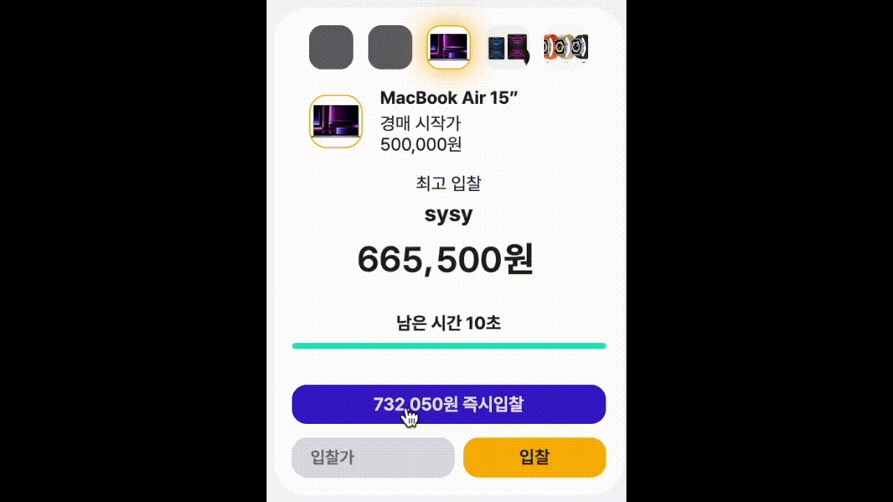

  - 슬라이딩 윈도우

    | 판매자                                                                              | 구매자                                                                       |
    | ----------------------------------------------------------------------------------- | ---------------------------------------------------------------------------- |
    | 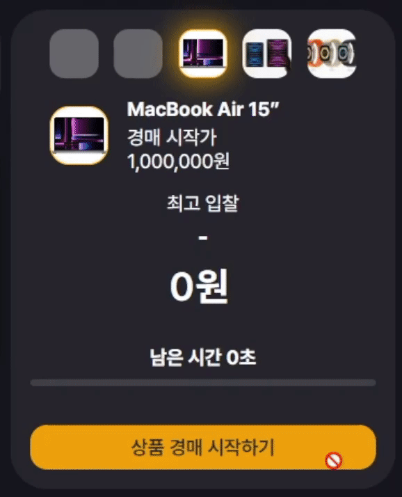 | 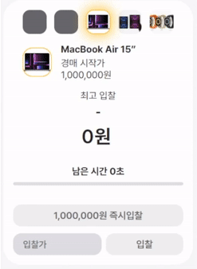 |

- 알림

  - 판매자

    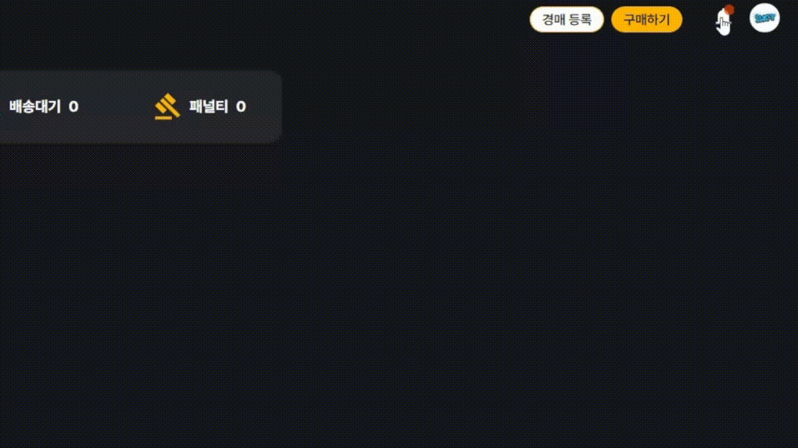

  - 구매자

    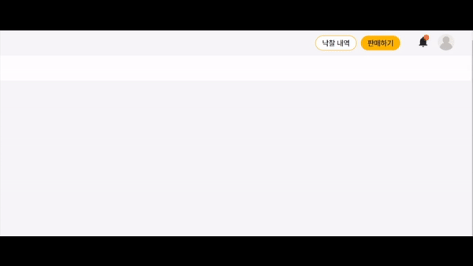

---

## 시스템 아키텍쳐

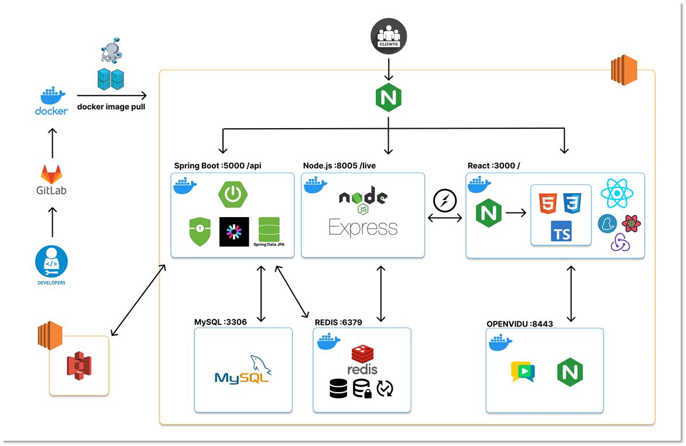

---

## 기술 스택

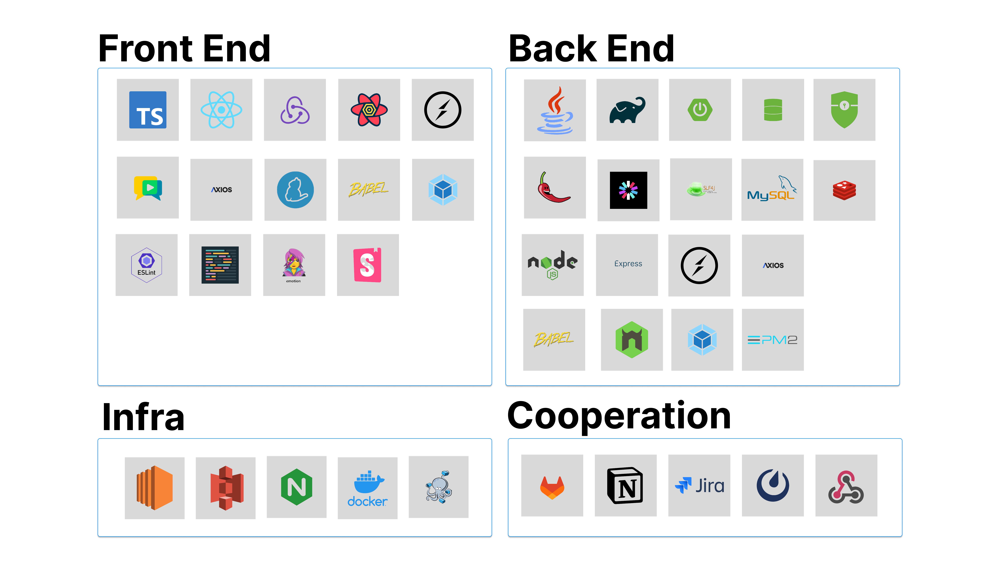

---

## ERD

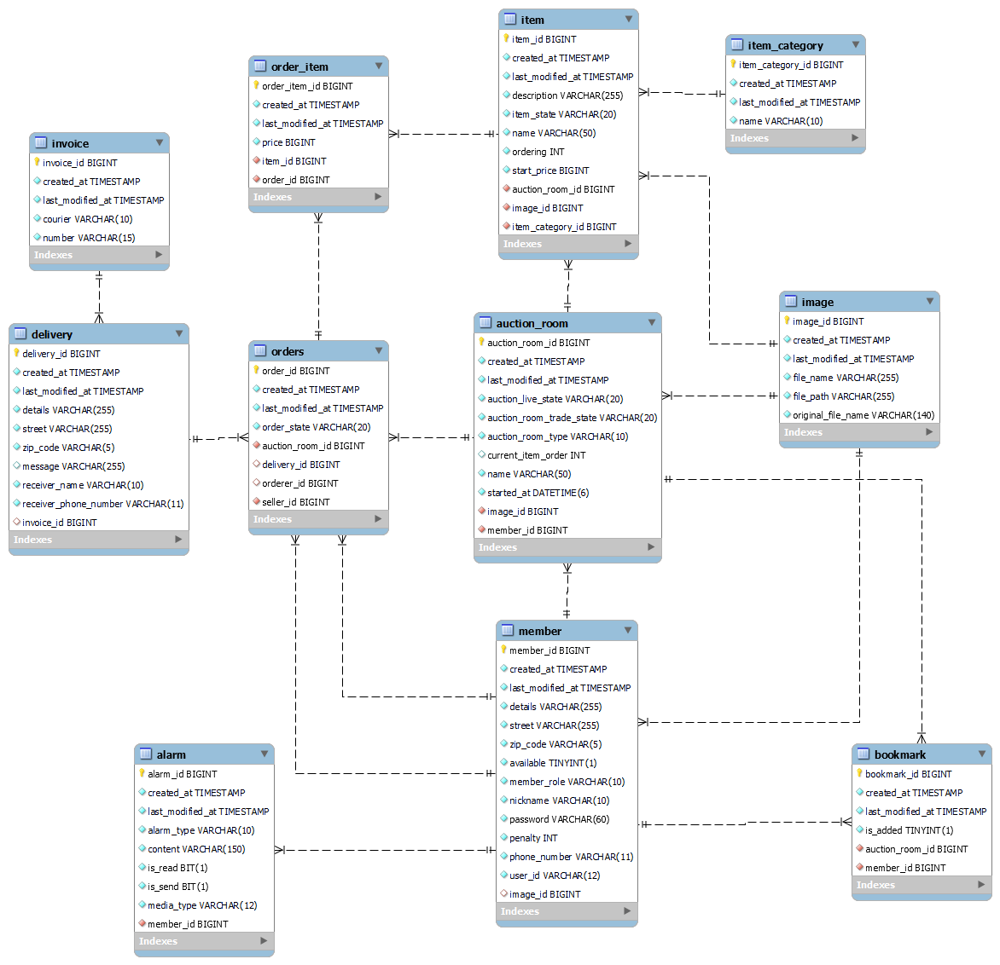

---

## WIREFRAME

[와이어프레임 PDF 파일 보기](./docs/wireframe.pdf)

---

## Convention

1. Frontend

   Airbnb JavaScript Style Guide를 기반으로 커스텀함

1. [Backend](./docs/convention/BidkingStyle.xml)

   Google Java Style Guide를 기반으로 커스텀함

1. [Git Commit Rule](./docs/convention/git_convention.md)

1. [Git Branch Strategy](./docs/convention/git_branch.md)

---

## 포팅 매뉴얼

- [사용 버전](./docs/manual/version.md)

- [포팅 매뉴얼](./docs/manual/porting_manual.md)

---

## 발표

- [1차 발표](./docs/presentation/230714_presentation.pdf)
- [2차 발표](./docs/presentation/230728_presentation.pdf)
- [최종 발표](./docs/presentation/230818_presentation.pdf)
